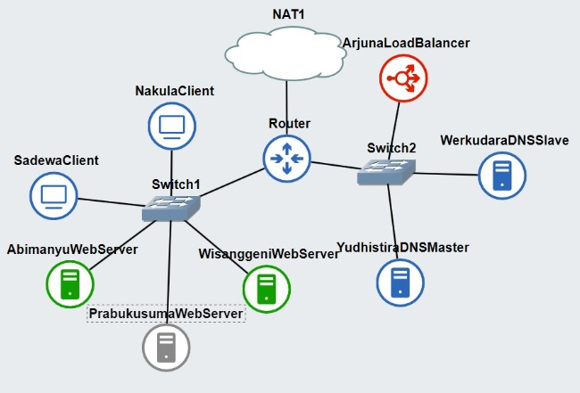

# Jarkom-Modul-2-E18-2023

Anggota Kelompok ''E18'' 
| Nama                      | NRP        |
|---------------------------|------------|
| Hanun Shaka Puspa         | 5025211051 |
| Cholid Junoto             | 5025201038 |

## SOAL 1
Yudhistira akan digunakan sebagai DNS Master, Werkudara sebagai DNS Slave, Arjuna merupakan Load Balancer yang terdiri dari beberapa Web Server yaitu Prabakusuma, Abimanyu, dan Wisanggeni. Buatlah topologi. Dengan IP Prefix kelompok E18 adalah ```192.215```

### Topologi


### Konfigurasi Setiap Node
#### Router
```
auto eth0
iface eth0 inet dhcp
auto eth1
iface eth1 inet static
    address 192.215.1.1
    netmask 255.255.255.0

auto eth2
iface eth2 inet static
    address 192.215.2.1
    netmask 255.255.255.0
```

#### NakulaClient
```
auto eth0
iface eth0 inet static
    address 192.215.1.2
    netmask 255.255.255.0
    gateway 192.215.1.1
```

#### SadewaClient
```
auto eth0
iface eth0 inet static
    address 192.215.1.3
    netmask 255.255.255.0
    gateway 192.215.1.1
```

#### AbimanyuWebServer
```
auto eth0
iface eth0 inet static
    address 192.215.1.4
    netmask 255.255.255.0
    gateway 192.215.1.1
```

#### PrabukusumaWebServer
```
auto eth0
iface eth0 inet static
	address 192.215.1.5
	netmask 255.255.255.0
	gateway 192.215.1.1
```

#### WisanggeniWebServer
```
auto eth0
iface eth0 inet static
    address 192.215.1.6
    netmask 255.255.255.0
    gateway 192.215.1.1
```

#### YudhistiraDNSMaster
```
auto eth0
iface eth0 inet static
	address 192.215.2.2
	netmask 255.255.255.0
	gateway 192.215.2.1
```

#### WerkudaraDNSSlave
```
auto eth0
iface eth0 inet static
    address 192.215.2.3
    netmask 255.255.255.0
    gateway 192.215.2.1
```

#### ArjunaLoadBalancer
```
auto eth0
iface eth0 inet static
    address 192.215.2.4
    netmask 255.255.255.0
    gateway 192.215.2.1
```

Pada Router, diinput command berikut pada `/root/.bashrc` supaya dapat terhubung ke internet dan antar node dapat saling terhubung.
```
iptables -t nat -A POSTROUTING -o eth0 -j MASQUERADE -s 192.215.0.0/16
echo nameserver 192.168.122.1 > /etc/resolv.conf
```

Pada `/root/.bashrc` di node-node lain, diinput command berikut supaya dapat terhubung ke internet.
```
echo nameserver 192.168.122.1 > /etc/resolv.conf
```

## SOAL 2
```Buatlah website utama pada node arjuna dengan akses ke `arjuna.yyy.com` dengan alias `www.arjuna.yyy.com` dengan yyy merupakan kode kelompok.```

Pada node Arjuna sebagai DNS master, dipanggil command berikut:
```
apt-get update
apt-get install bind9 -y
```
Lalu untuk membuat domain, dipanggil command berikut:
```
echo'
zone "arjuna.e18.com" {
        type master;
        file "/etc/bind/jarkom/arjuna.e18.com";
};
'> /etc/bind/named.conf.local
```

Kemudian dibuat folder yang akan diisi konfigurasi domain
```
mkdir /etc/bind/jarkom
cp /etc/bind/db.local /etc/bind/jarkom/arjuna.e18.com
```
Lalu pada file `arjuna.e18.com` diisikan konfigurasi dengan command sebagai berikut:
```
echo'
;
; BIND data file for local loopback interface
;
$TTL    604800
@       IN      SOA     arjuna.e18.com. root.arjuna.e18.com. (
                              2         ; Serial
                         604800         ; Refresh
                          86400         ; Retry
                        2419200         ; Expire
                         604800 )       ; Negative Cache TTL
;
@       IN      NS      arjuna.e18.com.
@       IN      A       192.215.2.4
@       IN      AAAA    ::1
www     IN      CNAME   arjuna.e18.com.
' > /etc/bind/jarkom/arjuna.e18.com
```
Untuk meload konfigurasi yang telah dimasukkan, service bind9 harus direstart:
```
service bind9 restart
```

## SOAL 3
```
Dengan cara yang sama seperti soal nomor 2, buatlah website utama dengan akses ke abimanyu.yyy.com dan alias www.abimanyu.yyy.com.
```

Penyelesaian soal 3 mirip dengan soal 2, namun dilakukan pada node Yudhistira sebagai DNS Master. Pertama, lakukan instalasi bind9.
```
apt-get update
apt-get install bind9 -y
```
Isikan konfigurasi domain pada konfigurasi di folder bind
```
echo'
zone "abimanyu.e18.com" {
        type master;
        file "/etc/bind/jarkom/abimanyu.e18.com";
};
'> /etc/bind/named.conf.local
```
Buat folder jarkom untuk konfigurasi.
```
mkdir /etc/bind/jarkom
cp /etc/bind/db.local /etc/bind/jarkom/abimanyu.e18.com
```
Lalu isikan konfigurasinya ke file konfigurasi abimanyu.e18.com
```
echo'
;
; BIND data file for local loopback interface
;
$TTL    604800
@       IN      SOA     abimanyu.e18.com. root.abimanyu.e18.com. (
                              2         ; Serial
                         604800         ; Refresh
                          86400         ; Retry
                        2419200         ; Expire
                         604800 )       ; Negative Cache TTL
;
@       IN      NS      abimanyu.e18.com.
@       IN      A       192.215.1.4 ;ip abimanyu
@       IN      AAAA    ::1
www     IN      CNAME   abimanyu.e18.com.
' > /etc/bind/jarkom/abimanyu.e18.com
```
Terakhir, restart service bind9
```
service bind9 restart
```

## SOAL 4
```
Kemudian, karena terdapat beberapa web yang harus di-deploy, buatlah subdomain parikesit.abimanyu.yyy.com yang diatur DNS-nya di Yudhistira dan mengarah ke Abimanyu.
```
Untuk membuat domain, dilakukan dengan menambahkan konfigurasi parikesit ke dalam konfigurasi yang sudah ada. Sehingga konfigurasi menjadi:
```
echo'
;
; BIND data file for local loopback interface
;
$TTL    604800
@       IN      SOA     abimanyu.e18.com. root.abimanyu.e18.com. (
                              2         ; Serial
                         604800         ; Refresh
                          86400         ; Retry
                        2419200         ; Expire
                         604800 )       ; Negative Cache TTL
;
@       IN      NS      abimanyu.e18.com.
@       IN      A       192.215.1.4 ;ip abimanyu
parikesit   IN  A       192.215.1.4 ;ip abimanyu
@       IN      AAAA    ::1
' > /etc/bind/jarkom/abimanyu.e18.com
```

## SOAL 5
```
Buat juga reverse domain untuk domain utama. (Abimanyu saja yang direverse)
```
Tambahkan konfigurasi ke config file bind
```
echo'
zone "abimanyu.e18.com" {
        type master;
        file "/etc/bind/jarkom/abimanyu.e18.com";
};

zone "1.215.192.in-addr.arpa" {
    type master;
    file "/etc/bind/jarkom/1.215.192.in-addr.arpa";
};' > /etc/bind/named.conf.local
```
Buat config filenya
```
cp /etc/bind/db.local /etc/bind/jarkom/1.215.192.in-addr.arpa
```
Lalu isikan konfigurasinya:
```
echo'
;
; BIND data file for local loopback interface
;
$TTL    604800
@       IN      SOA     abimanyu.e18.com. root.abimanyu.e18.com. (
                              2         ; Serial
                         604800         ; Refresh
                          86400         ; Retry
                        2419200         ; Expire
                         604800 )       ; Negative Cache TTL
;
1.215.192.in-addr.arpa.    IN  NS  abimanyu.e18.com.
4   IN  PTR    abimanyu.e18.com. ;byte ke-4 ip abimanyu
' > /etc/bind/jarkom/abimanyu.e18.com
```
Restart service bind
```
service bind9 restart
```

## SOAL 6
```
Agar dapat tetap dihubungi ketika DNS Server Yudhistira bermasalah, buat juga Werkudara sebagai DNS Slave untuk domain utama.
```
Pada config file bind, edit konfigurasi abimanyu sehingga menjadi seperti berikut
```
echo'
zone "abimanyu.e18.com" {
    type master;
    also-notify { 192.215.2.3; }; //IP Werkudara
    file "/etc/bind/jarkom/abimanyu.e18.com";
    allow-transfer { 192.215.2.3; }; //IP Werkudara
};

zone "1.215.192.in-addr.arpa" {
    type master;
    file "/etc/bind/jarkom/1.215.192.in-addr.arpa";
};' > /etc/bind/named.conf.local
```
Edit konfigurasi `named.conf.options`
```
echo 'options{
        directory "/var/cache/bind";
        // dnssec-validation auto;
        allow-query{any;};
        auth-nxdomain no;
        listen-on-v6{ any; };
};' > /etc/bind/named.conf.options
```
Lalu restart service bind9
```
service bind9 restart
```
Setelah itu, pada node Werkudara, lakukan command berikut:
```
echo 'nameserver 192.168.122.1 ' > /etc/resolv.conf
apt-get update
apt-get install bind9 -y
echo 'nameserver 192.215.2.2' > /etc/resolv.conf
```
Isikan konfigurasi untuk bind9
```
echo 'zone "abimanyu.e18.com" {
    type slave;
    masters { 192.215.2.2; }; //ip yudhistira
    file "/var/lib/bind/abimanyu.e18.com";
};' > etc/bind/named.conf.local
```
Edit file `named.conf.options`
```
echo 'options{
        directory "/var/cache/bind";
        // dnssec-validation auto;
        allow-query{any;};
        auth-nxdomain no;
        listen-on-v6{ any; };
};' > /etc/bind/named.conf.options
```
Restart service
```
service bind9 restart
```

## SOAL 7
```
Seperti yang kita tahu karena banyak sekali informasi yang harus diterima, buatlah subdomain khusus untuk perang yaitu baratayuda.abimanyu.yyy.com dengan alias www.baratayuda.abimanyu.yyy.com yang didelegasikan dari Yudhistira ke Werkudara dengan IP menuju ke Abimanyu dalam folder Baratayuda.
```
Edit file configurasi abimanyu di node yudhistira sehingga menjadi seperti berikut.
```
echo ';
; BIND data file for local loopback interface
;
$TTL    604800
@       IN      SOA     abimanyu.e18.com. root.abimanyu.e18.com. (
                        2023101001      ; Serial
                         604800         ; Refresh
                          86400         ; Retry
                        2419200         ; Expire
                         604800 )       ; Negative Cache TTL
;
@       IN      NS      abimanyu.e18.com.
@       IN      A       192.215.1.4     ; IP Abimanyu
www     IN      CNAME   abimanyu.e18.com.
parikesit IN    A       192.215.1.4     ; IP Abimanyu
ns1     IN      A       192.215.2.3     ; IP Werkudara
baratayuda IN   NS      ns1' > /etc/bind/jarkom/abimanyu.e18.com
```
Restart service bind
```
service bind9 restart
```
Pada node Werkudara, edit konigurasi zone menjadi:
```
echo 'zone "abimanyu.e18.com" {
    type slave;
    masters { 192.215.2.2; };
    file "/var/lib/bind/abimanyu.e18.com";
};

zone "baratayuda.abimanyu.e18.com"{
    type master;
    file "/etc/bind/baratayuda/baratayuda.abimanyu.e18.com";
};' > /etc/bind/named.conf.local
```
Lalu buat direktori untuk konfigurasi bind
```
mkdir /etc/bind/baratayuda
```
Isikan konfigurasinya
```
echo '
;
; BIND data file for local loopback interface
;
$TTL  604800
@   IN      SOA     baratayuda.abimanyu.e18.com.  root.baratayuda.abimanyu.e18.com. (
                    2022100601      ; Serial
                        604800      ; Refresh
                        86400       ; Retry 
                        2419200     ; Expire
                        604800  )   ; Negative Cache TTL
;
@   IN      NS      baratayuda.abimanyu.e18.com.
@   IN      A       192.215.1.4       ;
www IN      CNAME   baratayuda.abimanyu.e18.com.
' > /etc/bind/baratayuda/baratayuda.abimanyu.e18.com
```
Restart service
```
service bind9 restart
```

## SOAL 8
```
Untuk informasi yang lebih spesifik mengenai Ranjapan Baratayuda, buatlah subdomain melalui Werkudara dengan akses rjp.baratayuda.abimanyu.yyy.com dengan alias www.rjp.baratayuda.abimanyu.yyy.com yang mengarah ke Abimanyu.
```
Pada konfigurasi di node werkudara, tambahkan 2 line konfigurasi berikut
```
rjp IN      A       192.215.1.4       ;
www.rjp IN  CNAME   rjp.baratayuda.abimanyu.e18.com.
```
Sehingga menjadi
```
echo '
;
; BIND data file for local loopback interface
;
$TTL  604800
@   IN      SOA     baratayuda.abimanyu.e18.com.  root.baratayuda.abimanyu.e18.com. (
                    2022100601      ; Serial
                        604800      ; Refresh
                        86400       ; Retry 
                        2419200     ; Expire
                        604800  )   ; Negative Cache TTL
;
@   IN      NS      baratayuda.abimanyu.e18.com.
@   IN      A       192.215.1.4       ;
www IN      CNAME   baratayuda.abimanyu.e18.com.
rjp IN      A       192.215.1.4       ;
www.rjp IN  CNAME   rjp.baratayuda.abimanyu.e18.com.
' > /etc/bind/baratayuda/baratayuda.abimanyu.e18.com
```
Lalu restart service
```
service bind9 restart
```

## Soal 9
Arjuna merupakan suatu Load Balancer Nginx dengan tiga worker (yang juga menggunakan nginx sebagai webserver) yaitu Prabakusuma, Abimanyu, dan Wisanggeni. Lakukan deployment pada masing-masing worker.
### Arjuna
```
#lakukan installasi nginx
apt-get update
apt-get install nginx -y
service nginx start
```
Buat load balancing sebagai berikut menggunakan algoritma round-robin:
```echo '
upstream myweb {
        server 192.215.1.5; #prabukusuma
        server 192.215.1.4; #abimanyu
        server 192.215.1.6; #wisanggeni
}

server {
    listen 80;
    
    server_name arjuna.e18.com www.arjuna.e18.com;

    location / {
        proxy_pass http://myweb;
    }
}' > /etc/nginx/sites-available/jarkom
```
Setelah selesai lakukan perintah ```symlink``` dengan perintah sebagai berikut:
```ln -s /etc/nginx/sites-available/jarkom /etc/nginx/sites-enabled/jarkom```

jangan lupa lakukan perintah ```rm /etc/nginx/sites-enabled/default``` untuk menghapus file ```default``` supaya tidak bertabrakan pada saat kta melakukan installasi ```nginx``

kemudian lakukan restart ```nginx``` dengan cara ```service nginx restart```

Selanjutnya pada worker (Prabukusuma, Abimanyu, dan Wisanggeni) jalan kan perintah:
```service php7.0-fpm start

echo 'server {
        listen 80;

        root /var/www/jarkom;
        index index.php index.html index.htm index.nginx-debian.html;

        server_name _;

        location / {
                try_files $uri $uri/ /index.php?$query_string;
        }

        location ~ \.php$ {
                include snippets/fastcgi-php.conf;
                fastcgi_pass unix:/run/php/php7.0-fpm.sock;
        }

        location ~ /\.ht {
                deny all;
        }
}' > /etc/nginx/sites-available/jarkom

ln -s /etc/nginx/sites-available/jarkom /etc/nginx/sites-enabled/jarkom

rm /etc/nginx/sites-enabled/default

service nginx restart```

Setelah selesai di jalankan, kita dapat melakukan perintah:
```lynx http://arjuna.e18.com``` pada semua client


## Soal 10
Kemudian gunakan algoritma Round Robin untuk Load Balancer pada Arjuna. Gunakan server_name pada soal nomor 1. Untuk melakukan pengecekan akses alamat web tersebut kemudian pastikan worker yang digunakan untuk menangani permintaan akan berganti ganti secara acak. Untuk webserver di masing-masing worker wajib berjalan di port 8001-8003. Contoh
    - Prabakusuma:8001
    - Abimanyu:8002
    - Wisanggeni:8003

Pada soal nomor 10 kita hanya menambahkan port pada masing-masing worker (Prabakusuma:8001, Abimanyu:8002, Wisanggeni:8003)   selain itu  kita menambahkan :800X pada masing-masing server (X adalah nilai byte ke-3 pada masing masing worker)

```echo '
upstream myweb {
        server 192.215.1.5:8001; #prabukusuma
        server 192.215.1.4:8002; #abimanyu
        server 192.215.1.6:8003; #wisanggeni
}

server {
    listen 80;
    
    server_name arjuna.e18.com www.arjuna.e18.com;

    location / {
        proxy_pass http://myweb;
    }
}' > /etc/nginx/sites-available/jarkom```

### Client
pada client lakukan installasi ```lynx``
```
apt-get update
apt-get install lynx -y
```
kemudian jalankan perintah
```lynx http://arjuna.e18.com```

## KENDALA PENGERJAAN
Kendala yang dialami yaitu terkadang kurang teliti untuk melakukan konfigurasi